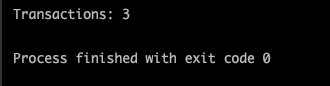
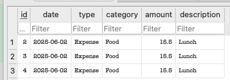
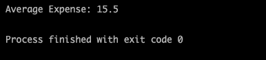
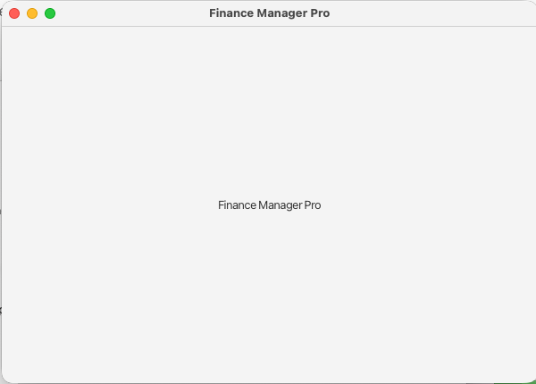
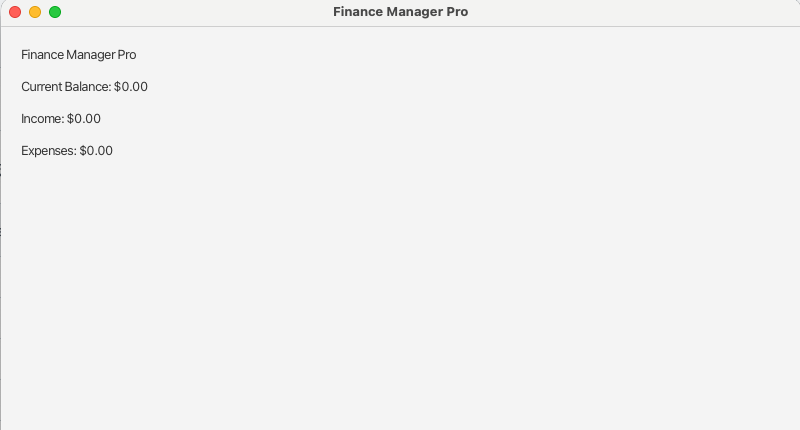
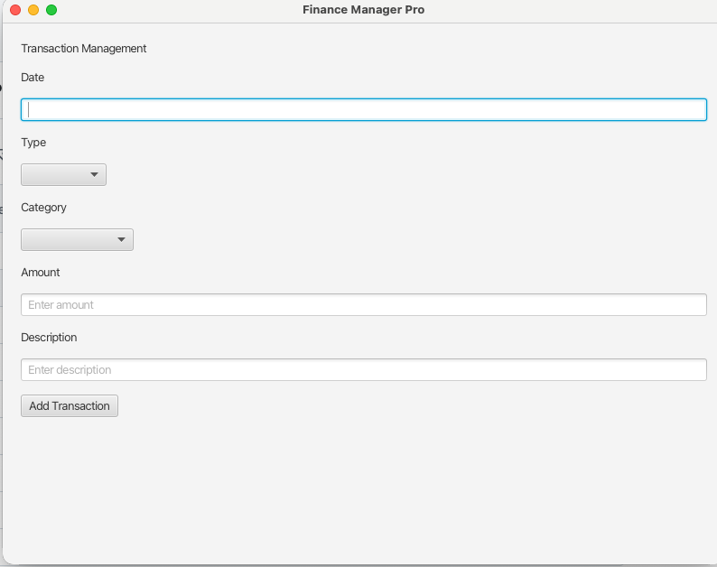

# Development Log
## 4th June 2026
**Completed**
* Created a GitHub Repository.
* Established project structure.
* Set up Java 25 development environment.
* Created SQLite database.
* Designed database schema.
* Created transactions table.
* Connected Java application to SQLite using JDBC.
* Implemented Transaction model.
* Implemented TransactionDAO.
* Added functionality to insert transactions into the database. 
* Added functionality to retrieve transactions from the database.

**Challenges**
* Troubleshooting IntelliJ project configuration.
* Resolving SQLite JDBC driver issues.
* Establishing a successful database connection.

**Next Objectives**
* Implement update transaction functionality.
* Implement delete transaction functionality.
* Calculate total income, expenses and account balance.

## 5th June 2026
**Completed**
* Implemented updateTransaction() method.
* Implemented a test for updating the transactions in Main.java.

* In the screenshot above it can be clearly seen that the id = '1' was changed.
Following is a brief description of the process that happened in the background-
1. The row with id = 1 was found.
2. The UPDATE query executed successfully.
3. The amount was changed to 15.5 to 20.0.
4. The description changed to "Updated lunch cost".
5. The second transaction was not affected.

* Implemented  deleteTransaction() method.
* Implemented a test for deleting the transactions in Main.java.

  
* In the screenshot above it can be clearly seen that id = '1' is no longer there
  Following is a brief description of the process that happened in the background-
1. The row with id = 1 was found.
2. The DELETE query executed successfully.
3. The row with id = '1' was deleted.

## 6th June 2026
**Completed**
* Created FinanceService class and added methods to calculate total income, expense and  current balance. 
* Created TransactionType enum (INCOME, EXPENSE).
* Created Category enum for income and expense categorization.
* Created Currency enum with support for GBP, USD, EUR and INR.
* Added currency names and symbols to Currency enum.
* Created budgets table in SQLite Database.
* Implemented Budget.java and added constructor, getters, setters and toString() method.
* Implemented BudgetDAO and added functionality to insert budgets and retrieve budgets from a database.

  
* In the screenshot above, it can be clearly seen that the test for adding a new budget was successful (The test was added in Main.java).

**Challenges**
* Understanding DAO and service layer separation.
* Planning budget management features for future dashboard integration.
* Deciding hw to support multiple currencies while maintaining clean code structure.

**New Objectives**
* Implement updateBudget() functionality.
* Implement deleteBudget() functionality.
* Integrate budget calculations into FinanceService.
* Calculate remaining budget per category.
* Design transaction entry forms with dropdown sections.
* Create a dashboard layout for balance, income, expenses and budget overview.

## 7th June 2026
**Completed**
* Implemented udateBudget() method.

* The above screenshot displays that the budget created previous with id = 1 has been updated.
* Implemented a test for updateBudget() method in Main.java.
* Implemented deleteBudget() method.

* The above screenshot displays that the budget created previous with id = 1 has been deleted.
* Implemented test for deleteBudget() method in Main.java.

**Challenges**
* Issues with implementing the tests due to a database error. (Resolved)

**New Objectives**
* Integrate budget calculations into FinanceService.
* Calculate total spending by category.
* Calculate remaining budget by category.
* Implement transaction analytics:
  * Transaction count
  * Largest expense
  * Average expense
* Begin planning JavaFX user interface structure.
* Design dashboard layout for balance, budgets and transaction summaries.

## 9th June 2026
**Completed**
* Created additional project documentation:
- project-overivew.md
- database_schema.md
- features-roadmap.md

* Implemented a method to count all the transactions from the database.
* Implemented a test in Main.java to count all the transactions

* In the above two screenshots, the first image displays the current number of transactions in the database and the second image proves that the method is working correctly as there are 3 transactions only at this stage.
* Implemented a method to get average expense from the database.
* Implemented a test in Main.java to calculate average expense from the database.

* The above screenshot shows the output for the average expense method's test in Main.java.
* Implemented a method to get remaining budget.
* Added JavaFX files to the libraries.
* Downloaded and configured JavaFX SDK 26.0.1.
* Added JavaFX libraries to InteliJ project.
* Configured JavaFX runtime and VM options.
* Implemented a test in MainFX.java to create a temporary window.

* Above is the screenshot for the temporary window created in the MainFX.java.
* Created ui package for frontend development.
* Created initial DashboardView.java.

* Above is the screenshot for the initial dashboard created. 
* Established frontend project structure for future screens.
* Created project-status.md for a detailed overlook for the viewers.

**Challenges**
* Troubleshooting JavaFX runtime configuration.
* Resolving "JavaFX runtime components are missing" error.
* Configuring JavaFX module path correctly InteliJ.
* Understanding JavaFX application lifecycle (Application, Stage, Scene).
* Organizing project structure for backend and frontend separation.

**Lessons Learned**
* JavaFX applications require module-path configuration runtime.
* Stage represents the application window.
* Scene represents the contents of a window.
* Layout containers such as VBox automatically arrange components.
* Separating backend logic from UI components improves maintainability.
* JavaFX projects benefit from a dedicated UI package structure.

**Next Objectives**
* Connect DashboardView to FinanceService.
* Display live balance data on the dashboard.
* Display total income and expenses.
* Display transaction count.
* Improve dashboard layout and styling.
* Create reusable dashboard cards.
* Begin development of transaction management screen.
* Begin development of budget management screen.

## 12th June 2026
**Completed**
* Created DashboardView.
* Connected DashboardView to FinanceService.
* Displayed live financial data from the SQLite database.
* Integrated:
  * Current Balance
  * Total Income
  * Total Expenses
  * Transaction Count
* Designed the initial Transaction Management screen.
* Added:
  * Date input field
  * Type dropdown (Income / Expense)
  * Category dropdown
  * Amount input field
  * Description input field
  * Add Transaction button
* Prepared the UI for database integration.
  
* The above screenshot shows the basic add transaction page with button.

**Challenges**
* Encountered JavaFX runtime component errors.
* Resolved IntelliJ VM option configuration issues.

**New Objectives**
* Connect Add Transaction button to TransactionDAO.
* Allow transactions to be inserted through the JavaFX interface.
* Create Budget Management screen UI.
* Begin navigation between Dashboard, Transactions, and Budgets.
* Improve dashboard styling and layout.

