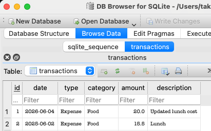
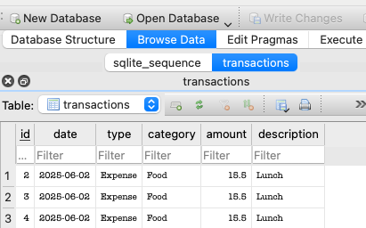
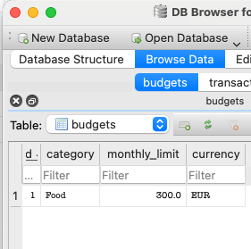
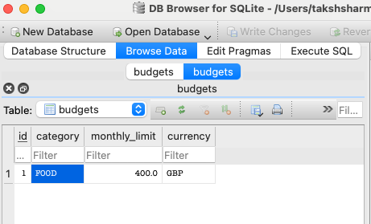
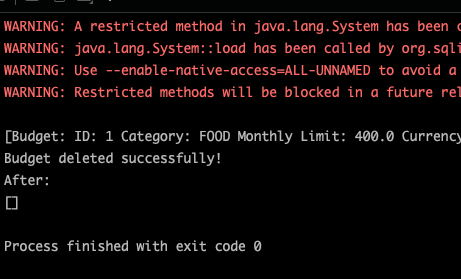

# Development Log
## 4th June 2026
**Completed**
* Created a GitHub Repository.
* Established project structure.
* Set up Java 25 development environment.
* Created SQLite database.
* Designed database schema.
* Created transactions table.
* Connected Java application to SQLite using JDBC.
* Implemented Transaction model.
* Implemented TransactionDAO.
* Added functionality to insert transactions into the database. 
* Added functionality to retrieve transactions from the database.

**Challenges**
* Troubleshooting IntelliJ project configuration.
* Resolving SQLite JDBC driver issues.
* Establishing a successful database connection.

**Next Objectives**
* Implement update transaction functionality.
* Implement delete transaction functionality.
* Calculate total income, expenses and account balance.

## 5th June 2026
**Completed**
* Implemented updateTransaction() method.
* Implemented a test for updating the transactions in Main.java.

* In the screenshot above it can be clearly seen that the id = '1' was changed.
Following is a brief description of the process that happened in the background-
1. The row with id = 1 was found.
2. The UPDATE query executed successfully.
3. The amount was changed to 15.5 to 20.0.
4. The description changed to "Updated lunch cost".
5. The second transaction was not affected.

* Implemented  deleteTransaction() method.
* Implemented a test for deleting the transactions in Main.java.

  
* In the screenshot above it can be clearly seen that id = '1' is no longer there
  Following is a brief description of the process that happened in the background-
1. The row with id = 1 was found.
2. The DELETE query executed successfully.
3. The row with id = '1' was deleted.

## 6th June 2026
**Completed**
* Created FinanceService class and added methods to calculate total income, expense and  current balance. 
* Created TransactionType enum (INCOME, EXPENSE).
* Created Category enum for income and expense categorization.
* Created Currency enum with support for GBP, USD, EUR and INR.
* Added currency names and symbols to Currency enum.
* Created budgets table in SQLite Database.
* Implemented Budget.java and added constructor, getters, setters and toString() method.
* Implemented BudgetDAO and added functionality to insert budgets and retrieve budgets from a database.
  
* In the screenshot above, it can be clearly seen that the test for adding a new budget was successful (The test was added in Main.java).

**Challenges**
* Understanding DAO and service layer separation.
* Planning budget management features for future dashboard integration.
* Deciding hw to support multiple currencies while maintaining clean code structure.

**New Objectives**
* Implement updateBudget() functionality.
* Implement deleteBudget() functionality.
* Integrate budget calculations into FinanceService.
* Calculate remaining budget per category.
* Design transaction entry forms with dropdown sections.
* Create a dashboard layout for balance, income, expenses and budget overview.

## 7th June 2026
**Completed**
* Implemented udateBudget() method.

* The above screenshot displays that the budget created previous with id = 1 has been updated.
* Implemented a test for updateBudget() method in Main.java.
* Implemented deleteBudget() method.

* The above screenshot displays that the budget created previous with id = 1 has been deleted.
* Implemented test for deleteBudget() method in Main.java.

**Challenges**
* Issues with implementing the tests due to a database error. (Resolved)

**New Objectives**
* Integrate budget calculations into FinanceService.
* Calculate total spending by category.
* Calculate remaining budget by category.
* Implement transaction analytics:
  * Transaction count
  * Largest expense
  * Average expense
* Begin planning JavaFX user interface structure.
* Design dashboard layout for balance, budgets and transaction summaries.

